## 21 Data Science Projects

A curated collection of end‑to‑end data science projects spanning regression, classification, clustering, NLP, computer vision, recommendations, time series, visualization, and deep learning. Each project is self‑contained with code, analysis, and (when applicable) an interactive Streamlit app.

### What you’ll find in each project
-   **Problem overview** and clear objectives
-   **Notebook(s)** with data preparation, modeling, and evaluation
-   **Reusable code** (pipelines, utilities, saved artefacts when useful)
-   **Interactive demo** via Streamlit and/or **Hugging Face Space** (when available)

### Getting started (Poetry)
1. Install Poetry (if not installed)
   - `curl -sSL https://install.python-poetry.org | python3 -`
   - Ensure Poetry is on your PATH (restart shell or follow installer notes)
2. Clone the repository
   - `git clone https://github.com/emretuncer256/21-data-science-projects.git`
   - `cd 21-data-science-projects`
3. Install shared dependencies at the repository root
   - `poetry install`
   - Optional: `poetry shell` to enter the virtual environment

### How to run
-   **Notebooks**: open the `.ipynb` files directly, or launch Jupyter with Poetry from the repo root (works in subfolders too)
    - `poetry run jupyter lab`
-   **Streamlit apps**: from the specific project folder run `poetry run streamlit run app.py`
-   **Model artefacts**: some projects include serialized models (e.g., `*.pkl`) for quick reuse

### Conventions
-   Small example data or dataset links are referenced inside each project
-   Random seeds are used where appropriate for reproducibility
-   Clear naming for features, targets, and pipeline steps

### Tech stack
-   Python, pandas, NumPy, scikit‑learn
-   Visualization: Matplotlib, Seaborn, Plotly
-   Apps: Streamlit, Hugging Face Spaces
-   Packaging/utility: joblib, Poetry

### Current projects

  

    <a href="1.%20Retail%20Price%20Optimization%20-%20Regression/">
      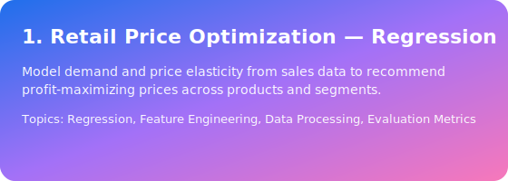
    </a>
    

      
      
      
    

  

  

    <a href="2.%20Car%20Price%20Prediction%20-%20Regression/">
      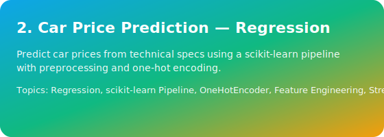
    </a>
    

      
      
      
    

  

  

    <a href="3.%20Food%20Delivery%20Time%20Prediction%20-%20Regression/">
      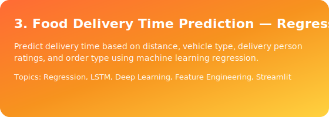
    </a>
    

      
      
      
    

  

  

    <a href="4.%20Iris%20Flower%20-%20Classification/">
      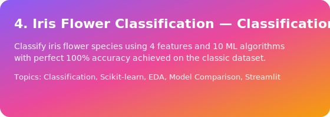
    </a>
    

      
      
      
    

  

  

    <a href="5.%20Text%20Emotions%20-%20Classification/">
      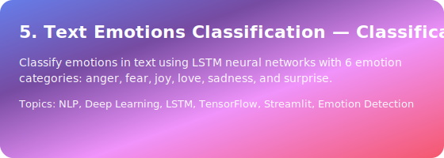
    </a>
    

      
      
      
    

  

  

    <a href="6.%20Mobile%20Price%20-%20Classification/">
      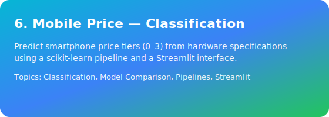
    </a>
    

      
      
      
    

  

  

    <a href="7.%20Music%20Genres%20-%20Clustering/">
      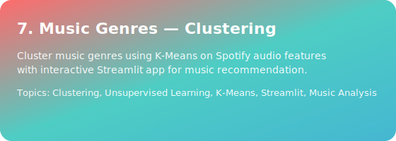
    </a>
    

      
      
      
    

  

  

    <a href="8.%20Credit%20Card%20-%20Clustering/">
      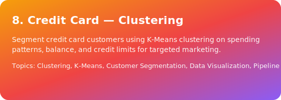
    </a>
    

      
      
      
    

  

  

    <a href="9.%20Customer%20RFM%20Analysis%20-%20Clustering/">
      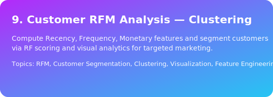
    </a>
    

      
      
      
    

  

  

    <a href="10.%20MNIST%20Digits%20Classification%20-%20Computer%20Vision/">
      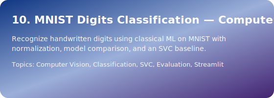
    </a>
    

      
      
      
    

  

  

    <a href="11.%20Fashion%20Recommendation%20System%20-%20Computer%20Vision/">
      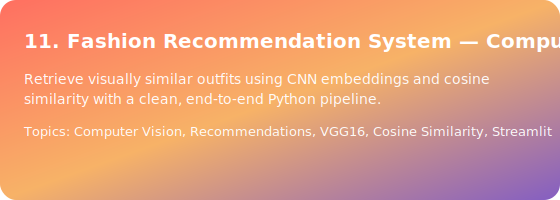
    </a>
    

      
      
    

  

  

    <a href="12.%20Real-time%20OCR%20-%20Computer%20Vision/">
      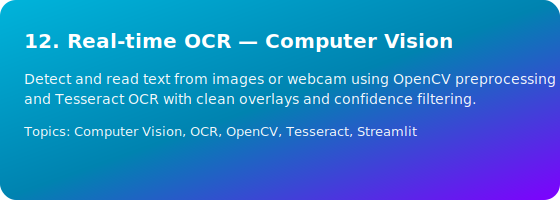
    </a>
    

      
      
      
    

  

### Contact
For questions or suggestions, please open an issue or reach out my social accounts via GitHub.

---

This README will evolve as new projects are added.